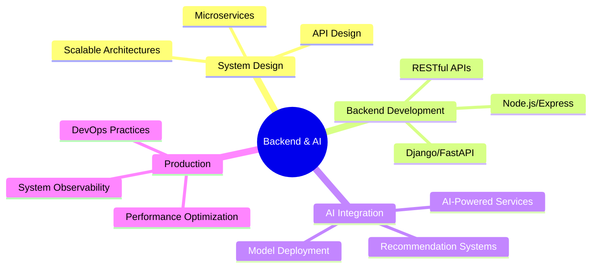

# Hi, I'm Mustafa 👋

### Backend Engineer • AI Integration Specialist • System Architect

*Building scalable backend systems and AI-powered applications that solve real problems*

---

## 🚀 About Me

I'm a **backend-focused software developer** specializing in system design, scalable architectures, and AI-driven products.  

My passion lies in building **production-ready backend services** that integrate cutting-edge AI technologies with robust, maintainable code.

- 🔧 Started with **ASP.NET** internships, building foundational backend concepts
- 🌟 Currently working with **Node.js, Django, and FastAPI** for modern backend architectures
- 🤖 Integrating **AI/ML models** into production backend systems
- 🏗️ Designing **clean, scalable architectures** that perform under load
- 📊 Focus on **system observability** and production behavior

---

## 📊 GitHub Analytics

## 💻 Tech Stack

### Backend Core (Primary Focus)

### AI & Data Science

### Frontend (Supporting)

### DevOps & Infrastructure

### Databases

---

## 🎯 Core Expertise

---

## 🚀 Live Production Systems

<table>
<tr>
<td width="50%">

### 🎧 Moodweave
**AI-Based Music Recommendation Platform**

- 🤖 AI-driven mood analysis
- 🎵 Personalized music recommendations
- ⚡ Real-time processing backend
- 🔗 [Visit Live](https://moodweave.mustafaerhanportakal.com)

</td>
<td width="50%">

### 🖥️ Management Panel
**Enterprise Web Application**

- 🔐 Secure authentication system
- 📊 Data management backend
- 🏗️ Scalable architecture
- 🔗 [Visit Live](https://yonetim.mustafaerhanportakal.com)

</td>
</tr>
</table>

---

## 📜 Certifications

**IBM Full Stack Software Developer – Professional Certificate**  
*Coursera • IBM*

---

## 📫 Let's Connect

**Open to backend engineering opportunities and AI integration projects**

---

*Building robust backend systems and AI-powered applications that solve real-world problems*

